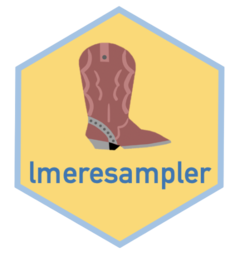

# lmeresampler 

[](https://github.com/aloy/lmeresampler/actions)
[](https://cran.r-project.org/package=lmeresampler)


<!-- README.md is generated from README.Rmd. Please edit that file -->

The `lme4` and `nlme` packages have made fitting nested linear
mixed-effects models quite easy. Using the functionality of these
packages we can easily use maximum likelihood or restricted maximum
likelihood to fit our model and conduct inference using our parametric
toolkit. In practice, the assumptions of our model are often violated to
such a degree that leads to biased estimators and incorrect standard
errors. In these situations, resampling methods such as the bootstrap
can be used to obtain consistent estimators of the bias and standard
errors for inference. `lmeresampler` provides an easy way to bootstrap
nested linear-mixed effects models using either the parametric,
residual, cases, CGR (semi-parametric), or random effects block (REB)
bootstrap fit using either `lme4` or `nlme`. The output from
`lmeresampler` is an `lmeresamp` object. Moreover, the `lmeresampler`
package has its own `print()` and `confint()` functions, both of which
follow the syntax of a generic `print()` and `confint()` function; thus,
the two commands may be used with `lmeresamp` objects.

## Installation

You can install the latest released version from CRAN with:

``` r
install.packages("lmeresampler")
```

or the latest development version from GitHub:

``` r
if(!require(devtools)) install.packages("devtools")
devtools::install_github("aloy/lmeresampler")
```

## Usage

Below is a short example of how to execute a parametric bootstrap for
models fit either by `lme4` or by `nlme`. For a complete guide outlining
the purpose of `lmeresampler`, the structure of `lmeresamp` objects,
each of the bootstrap types, how to implement parallelization with
`bootstrap()` calls, directions for future developers, and examples,
please see the package vignette, available on the `lmeresampler`
website.

First, fit the necessary model(s) with the LME package of your choice.
Here we show the same model fit first with `lme4`, then with `nlme`:

``` r
library(lmeresampler)

library(lme4)
vcmodA <- lmer(mathAge11 ~ mathAge8 + gender + class + (1 | school), data = jsp728)

library(nlme)
vcmodB <- lme(mathAge11 ~ mathAge8 + gender + class, random = ~1|school, data = jsp728)
```

Now, to perform a parametric bootstrap, first specify the model to be
used, then the function to return the parameters of interest, then `type
= "parametric`, and finally, the number of bootstrap resamples to be
computed:

``` r
# let's set .f = fixef to specify that we want only the fixed effects bootstrapped

# lme4
lmer_par_boot <- bootstrap(vcmodA, .f = fixef, type = "parametric", B = 100)

# nlme
lme_par_boot  <- bootstrap(vcmodB, .f = fixef, type = "parametric", B = 100)
```

The four other bootstrap types (residual, cases, CGR, and REB) may be
executed in a similar way, with some minor changes.

## References

A full list of references may be found in the package vignette.
